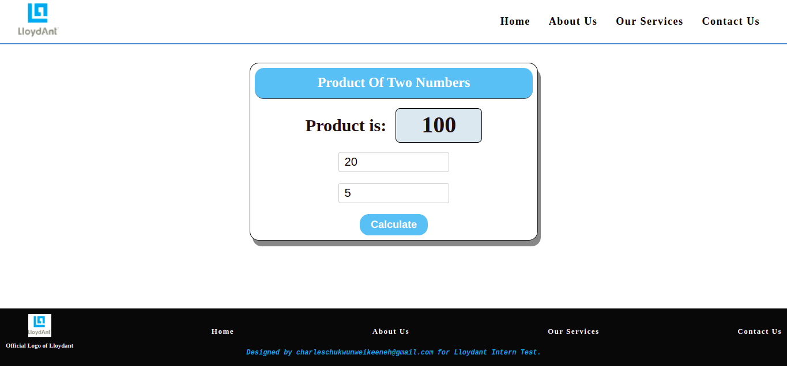
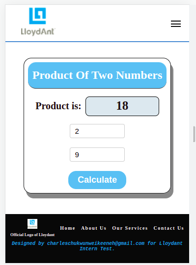

# Sum-Of-Two-Inputs-Test

> Description of the test.

I developed a simple html page with a navbar, footer and body.
It also has a simple function written with vanilla JavaScript that takes an input of 2 numbers and returns a product of the two inputs. The function is written in such a way as not to allow an input that's not a number. I also wrote a jest test for the function.

## Built With

- Major languages
  HTML
  CSS
  JavaScript

- Frameworks
  None

- Technologies used
  Use of node modules and ES6 syntax

## Live Demo (if available)

[Live Demo Link](https://charlyeneh.github.io/Awesome-books-ES6/)

## Getting Started

Clone the Repo and power on the live-server to view the page or click on the live demo link.

To get a local copy up and running follow these simple example steps.

### Prerequisites

Install a code editor and have a working browser.

### Setup

Clone the Repo and power up the live-server to view the project on your browser.

### Install

Install a code editor and a browser.
Install a packege manager - npm.

### Usage

This App can be used for simple multiplications task.

### Run tests

### Deployment

This App was deployed using the github apps deployment.

## Author

👤 **Eneh Charles Chukwunweike**

- GitHub: [@charlyeneh](https://github.com/charlyeneh)
- Twitter: [@twitterhandle](https://twitter.com/ProgrammerBaby?s=09)
- LinkedIn: [LinkedIn](https://www.linkedin.com/in/charles-chukwunweike-eneh)

## 🤝 Contributing

Contributions, issues, and feature requests are welcome!

Feel free to check the [issues page](https://github.com/charlyeneh/Awesome-books-ES6/issues/).

## Show your support

Give a ⭐️ if you like this project!

## Acknowledgments

- Hat tip to anyone whose code was used
- Inspiration
- etc

## 📝 License

This project is [MIT](./MIT.md) licensed.
